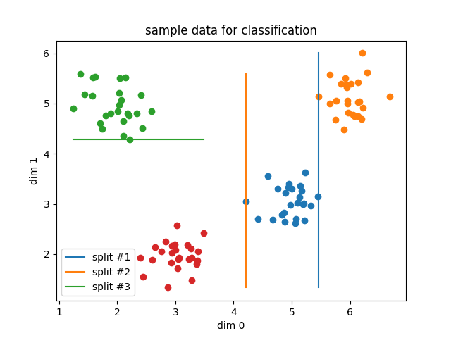

% Of Trees and Forests
% Priyam Tejaswin
% July 7, 2019

I took these notes in VIM. All of it. Yeah. Deal with it. Rendered in Latex with `pandoc`. 

*Only took me 2 hours to begin using screen buffers with a new keymap for splits.*

*Perhaps this was not such a good idea...*

Main reference is [the ESL book](https://web.stanford.edu/~hastie/ElemStatLearn/) and the Wiki pages.

## Regression.
Two main algorithms: CART and C4.5. A decision tree splits the feature-space into "halves" -- you pick a feature at random, take a cut at random, and the data is split on that cut.

In 2d feature-space, these are rectangular partitions.

{ width=400px }

The **response** from each region is the average of all the target values $y_i$ in that region.

How to find the best partition? Consider a variable $j$ and a split point $s$. With these selected, we can define two regions $R_1, R_2$ such that

$$
R_1(j, s) = \{X|X_j < s\}\ \text{and} \ R_2(j, s) = \{X|X_j > s\}
$$

We want to find these regions such that the overall Sum of Squared Errors (SSE) in the data is minimal
$$
\sum_{r \in R} \sum_{i \in r} (y_i - \hat{y_r})^2
$$

Algorithm:

1. Take all the data into one collection and calculate the SSE.
2. Iterate over all variables and the values per variable to find possible split points. Select the best one which minimizes the SSE compared to the parent SSE.
3. Partition the data into two regions based on the split.
4. Repeat from (2) for the two new regions until convergence.

The convergence criterion could be a minimum sample size per leaf or that the reduction in SSE has to exceed some threshold.

## Pruning.
In practice, we avoid the threshold convergence -- a better, more worthwhile split could come after a poor split. We rather let the tree get built with the min-samples criteria and then apply pruning.

With the data points at the leaf nodes, a pruned tree is simply a sub-tree $T_c$ with some intermediate nodes missing from the master tree $T_0$. We will *try* different sub-trees and pick the one which minimizes the test-error. Of course, trying all possible combinations ($2^n$ for $n$ intermediate nodes) is not an option.

The approach we will use is called **Cost-Complexity Pruning**. For given $T$, we define the cost as 
$$
C_{\alpha}(T) = SSE(T) + \alpha |T|
$$

where $SSE$ is the Sum of Squared Errors and $|T|$ is the number of leaf nodes in the tree.

This will penalize larger trees, prone to overfitting, with $\alpha = 0$ being the OG trees. The best $\alpha$ is arrived at by k-fold CV on the training data. For each $\alpha$, find the intermediate node (above two leaf nodes) that leads to the lowest cost. This is the best sub-tree for $\alpha=1$. We use this sub-tree to remove the best intermediate node for $\alpha=2$. This continues for different values of $\alpha$. Finally, we select the one with the best average CV score.

## Classification.
The target is now one of $K$ classes. We need to change our splitting criteria from squared error to something more suitable for this discrete data. Given a region $m$ and target class $k$, we can define the proportion of that class in the leaf as

$$
\hat{p}_{mk} = \frac{1}{N_m} \sum_{x_i \in R_m} I(y_i = k)
$$

At prediction time, the *class* of the data is the class that has the highest count in the leaf -- i.e. the majority class.

If we define $k(m) = \text{arg max}_k\ \hat{p}_{mk}$ as the probability of the most popular class in region $m$, then the **Misclassification Error** for the region is $1 -  \hat{p}_{mk(m)}$. The objective in some sense is still the same -- this error will be 0 if we have the same predicted label for every sample in a leaf/region. We will use this for pruning.

Another impurity measure is the **Gini Index**. This is defined over all classes present in the leaf.

$$
\sum_{k=1}^K \hat{p}_{mk}  (1 - \hat{p}_{mk}) 
$$

We use Gini for the tree fitting.

## Instability and Bagging.
A small change in the data can result in vastly different splits. Also, the errors in the splits cascades. **Bootstrap Aggregation** i.e. **Bagging** is used to counter this.

Given a training set with $m$ points, you sample a subset of the data -- say $n$ points -- at random *with replacement* $k$ different times into $k$ different bags. This is the **Bootstraping** part. If $n = m$, then around 60% of unique points from the original set should be present in every bag -- rest can be repeated. 60% comes from $1 - \frac{1}{e}$

We now fit a tree on every bag to get a $k$ different models. For regression, we take the average of all model predictions. For classification, we take the majority vote across the models. This is the **Aggregation** part.

The reduction in variance comes from the **Boostrap** process. The with-replacement sampling creates *different* datasets since only a part of the original dataset is repeated in every bag. Hence, the trees you train will be un-correlated. Individual trees will be sensitive to the noise in their data, but the averaged predictions will have less variance than a single tree.

# Random Forests.
After bagging, in the RF algorithm, every split is made from a **random subset** of features. This is done to further de-correlate the trees. For classification problems, the suggested number is $\sqrt{p}$. For regression, it's $p/3$. Here $p$ is the original number of features in the dataset.
