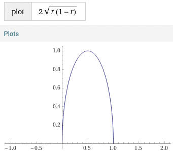
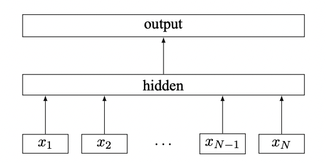
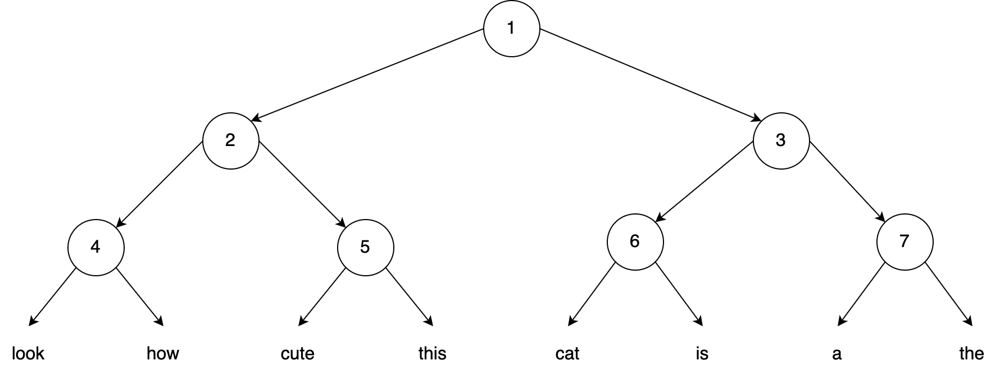
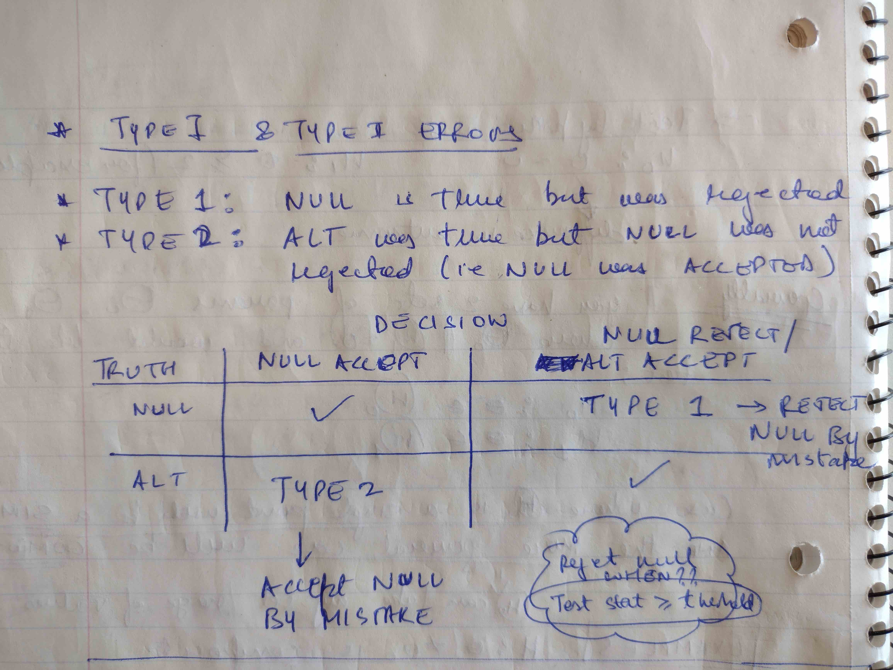
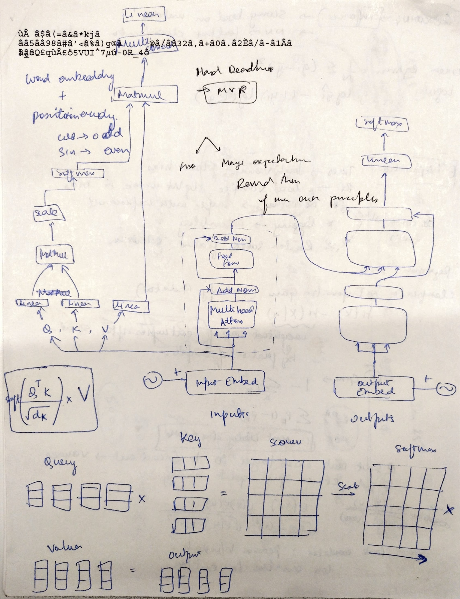
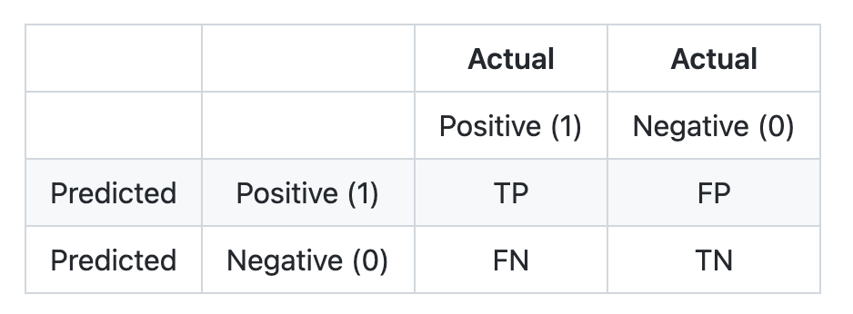

% A technical review of Priyam's resume
% Priyam Tejaswin
% Last updated: August 31st, 2022

Main references are Wiki pages, and the citations therein. Notes are written in Markdown, and rendered using Pandoc: `cat trees.md | ./filter.py | pandoc --pdf-engine=xelatex -o doc.pdf -N --toc`

# Trees
Some key concepts.

**Entropy**, $H(X)$, of a random variable is the average level of "uncertainity" inherent to the variable's possible outcomes. If a discrete random variable $X$ can take $x_i, i \in [1, n]$ values, then the entropy is defined as
$$
H(X) = - \sum_i p(x_i)\ \log p(x_i)
$$

**Conditional Entropy**, $H(Y | X)$, is the weighted entropy of $Y$ given $X$.
$$
H(Y | X) = \sum_i p(x_i)\ H(Y|x_i)
$$

**Information Gain**, $IG(T, X=a)$, is the reduction in information entropy $H$ from a prior state, to a state that takes some information as given.
$$
IG(T, X=a) = H(T) - H(T | X=a)
$$

In general, you can contruct a Decision Tree for any data (discretize continuous data) by trying to maximize IG. There are also some other criterion discussed below.

## Regression
Two main algorithms: CART and C4.5. A decision tree splits the feature-space into "halves" -- you pick a feature at random, take a cut at random, and the data is split on that cut.

In 2d feature-space, these are rectangular partitions.

{ width=400px }

The **response** from each region is the average of all the target values $y_i$ in that region.

How to find the best partition? Consider a variable $j$ and a split point $s$. With these selected, we can define two regions $R_1, R_2$ such that

$$
R_1(j, s) = \{X|X_j < s\}\ \text{and} \ R_2(j, s) = \{X|X_j > s\}
$$

We want to find these regions such that the overall Sum of Squared Errors (SSE) in the data is minimal
$$
\sum_{r \in R} \sum_{i \in r} (y_i - \hat{y_r})^2
$$

Algorithm:

1. Take all the data into one collection and calculate the SSE.
2. Iterate over all variables and the values per variable to find possible split points. Select the best one which minimizes the SSE compared to the parent SSE.
3. Partition the data into two regions based on the split.
4. Repeat from (2) for the two new regions until convergence.

The convergence criterion could be a minimum sample size per leaf or that the reduction in SSE has to exceed some threshold.

### Alternate criteria

You can use different metrics (like absolute error) for fitting the tree.

## Pruning
In practice, we avoid the threshold convergence -- a better, more worthwhile split could come after a poor split. We rather let the tree get built with the min-samples criteria and then apply pruning.

With the data points at the leaf nodes, a pruned tree is simply a sub-tree $T_c$ with some intermediate nodes missing from the master tree $T_0$. We will *try* different sub-trees and pick the one which minimizes the test-error. Of course, trying all possible combinations ($2^n$ for $n$ intermediate nodes) is not an option.

The approach we will use is called **Cost-Complexity Pruning**. For given $T$, we define the cost as 
$$
C_{\alpha}(T) = SSE(T) + \alpha |T|
$$

where $SSE$ is the Sum of Squared Errors and $|T|$ is the number of leaf nodes in the tree.

This will penalize larger trees, prone to overfitting, with $\alpha = 0$ being the OG trees. The best $\alpha$ is arrived at by k-fold CV on the training data. For each $\alpha$, find the intermediate node (above two leaf nodes) that leads to the lowest cost. This is the best sub-tree for $\alpha=1$. We use this sub-tree to remove the best intermediate node for $\alpha=2$. This continues for different values of $\alpha$. Finally, we select the one with the best average CV score.

## Classification
The target is now one of $K$ classes. We need to change our splitting criteria from squared error to something more suitable for this discrete data. Given a region $m$ and target class $k$, we can define the proportion of that class in the leaf as

$$
\hat{p}_{mk} = \frac{1}{N_m} \sum_{x_i \in R_m} I(y_i = k)
$$

At prediction time, the *class* of the data is the class that has the highest count in the leaf -- i.e. the majority class.

If we define $k(m) = \text{arg max}_k\ \hat{p}_{mk}$ as the probability of the most popular class in region $m$, then the **Misclassification Error** for the region is $1 -  \hat{p}_{mk(m)}$. The objective in some sense is still the same -- this error will be 0 if we have the same predicted label for every sample in a leaf/region. We will use this for pruning.

Another impurity measure is the **Gini Index**. This is defined over all classes present in the leaf.

$$
\sum_{k=1}^K \hat{p}_{mk}  (1 - \hat{p}_{mk}) 
$$

We use Gini for the tree fitting.

## Advantage of Information Gain?
Accuracy becomes a problem with unbalanced data -- especially when target classes are imbalanced. Entropy has a slight advantage due to the $- p \log p$ term. As $p \rightarrow 0$, entropy $\rightarrow 0$, which can be achieved by creating *large, homogeneous* groups. This is usually more stable.

## Are Entropy and Gini good measures of feature importance?
No.

Typically, features with many unique/partition values will have higher importance (by Gini, or IG). This is because these features might promote "unique" binning/partitioning, while prehibiting generalization.

Say you want to predict which of your customer's are likely to buy a "special" program. One of the input attributes might be the each customer's id-number. This attribute will have high IG/Gini scores, because it almost uniquely identifies individuals. But it will be a horrible predictor for new members.

## Impurity measure
Say a tree is being fit to reduce metric $m$. Once a feature $f$ is selected at a node $t$, we can compute its importance as follows

$$
\text{importance of }f = \frac{n_t}{N} \times \left( m_t - \left( \frac{n_{t \text{ left}}}{n_t}m_{t \text{ left}} + \frac{n_{t \text{ right}}}{n_t}m_{t \text{ right}} \right) \right)
$$

## Feature representations

For continuous data, the splitting happens naturally. For categorical data, you can try to one-hot encode. But with high cardinality, this will 

1. Explode data size
2. Require very deep trees for exploration

### Naive target encoding
You could take the average of all your target data for each enum value. This will work, but lead to two problems.

1. You are leaking the target data into the *predictors* data
2. You don't have any way to impute this feature for unseen data

### Historical target encoding
A better way would be to average of the target data in the past, if you are following a time-dependency.

### Optimal partitioning
Outside of features with two enums, you will have to consider all possible subsets for determining the "split" criteria -- note that one-hot encoding also does not consider all possible subsets; it only considers one-vs-rest.

A better way (determined by Fisher in his paper on "Grouping for Optimal Homogeniety") is to order your enums by the expected value of the class label. In binary classification, this corresponds to computing the average class score of every category $k$ as:

$$
\frac{\text{count where feature} = k \text{ and } y = 1}{\text{count where feature} = k}
$$

You then sort the categories by this value, and treat them like continuous feature split points.

For regression, consider the RMSE of the subset where the "true" value is the mean of values in the subset. 

### Feature bundling

A popular technique in modern libraries, feature bundling will try to combine different mutually exclusive features (like the ones created by one-hot vectors) into smaller bundles without loss of information. Which can then be used as continuous features.

## Why is tree fitting slow

You have to sort all possible split positions in-order, for every node in the tree, then then consider every split point. For $F$ features and $N$ data points, this is a $F \times N \times N \log N$ operation.

Modern libraries only consider a fixed-length histogram (256, or 512 buckets). This makes the split partitions fixed, and no sorting is required. Now, the complexity reduces to $F \times N$.

# Tree Instability and Bagging
A small change in the data can result in vastly different splits. This suggests high-variance. 

Depth of the tree determines the bias. Short trees are too simplistic -- high bias. Deep trees have low bias -- do not make strong assumptions about the data (like limiting to depth=2,3, etc).

**Bootstrap Aggregation** i.e. **Bagging** is used to counter high-variance, and reduce over-fitting.

Given a training set with $m$ points, you sample a subset of the data -- say $n$ points -- at random *with replacement* $k$ different times into $k$ different bags. This is the **Bootstraping** part. If $n = m$, then around 60% of unique points from the original set should be present in every bag -- rest can be repeated. 60% comes from $1 - \frac{1}{e}$

We now fit a tree on every bag to get a $k$ different models. For regression, we take the average of all model predictions. For classification, we take the majority vote across the models. This is the **Aggregation** part.

The reduction in variance comes from the **Boostrap** process. The with-replacement sampling creates *different* datasets since only a part of the original dataset is repeated in every bag. Hence, the trees you train will be un-correlated. Individual trees will be sensitive to the noise in their data, but the averaged predictions will have less variance than a single tree.

This can also be analyzed mathematically. If $n$ random variables have variance $\sigma^2$, and the average estimator is $\frac{1}{n} \sum_{i=1}^n x_i$, then its variance will be
$$
\text{Var} \left( \frac{1}{n} \sum_i x_i \right) \\
= \frac{1}{n^2} \sum_i \text{Var}(x_i) \\
= \frac{1}{n^2} n \sigma^2 \\
= \frac{\sigma^2}{n} 
$$

## What about the Bias?
The Bias of a individual tree built using the Bootstrapped data will be *higher* than the bias of the tree with the full data, simply because the data is being repeated, and because of random feature selection it will not have access to all features for fitting. 

But the gain from the variance reduction is what leads to better performance.

# Random Forests
After bagging, in the RF algorithm, every split is made from a **random subset** of features. This is done to further de-correlate the trees. For classification problems, the suggested number is $\sqrt{p}$. For regression, it's $p/3$. Here $p$ is the original number of features in the dataset.

## What about the Bias?
The bias of the random forest is the *same as the bias of an indivial Bootstrapped tree* because the limited feature space imposes further restrictions on the model.

# Boosting
> Can a set of weak learners create a single strong learner?

**Boosting** attempts to answer this question. The *weak learner* here is one that has very high bias, and has very little correlation with the true classification -- think of a very shallow tree. **AdaBoost** is one particular "proved" boosting method which iteratively tweaks weak-learners by forcing them to *focus* on harder samples. The rough outline is as follows:

1. Weight training inputs by difficulty
2. Evaluate weak learners
3. Say weak learner $w_1$ failed on samples $x_1, x_5, x_9$
4. The next "iteration" of the weak learner will focus more on these samples

## AdaBoost formulation
Consider a dataset $D$ with $n$ points: $x_i, i \in [1, n]$ with binary labels: $y_i \in \{-1, 1\}$. You also have $T$ which is the maximum iterations. Every training sample $x_i$ is initialized with some weight $w_i$. This could be uniform initially.

You will learn $T$ weak learners over time. The final form of the classifier is as follows:
$$
g_T (x) = \sum_{t=1}^T f_t(x) = \sum_t \alpha_t h_t(x)
$$

where the $sign$ of $g_T(x)$ is the predicted class label and the value is the confidence.

Each weak learner produces its hypothesis $h_t(x_i)$ for each training sample. Every learner is assigned a coefficient $\alpha_t$ such that the total training error (as defined by the aggregate) is minimized:
$$
\epsilon_t = \sum_{i=1}^n  \text{Error}\bigg[ g_{t-1}(x_i) + \alpha_t h_t(x_i) \bigg]
$$

## Derivation

Say you have an existing pool of $L$ classifiers. Each classifier $j$ follows the same hypothesis function $h_j()$, and the $sign$ of $h_j(x_i)$ determines the class for sample $x_i$. Let this signed output be $k_j(x_i)$ Since each classifier has a "trust" coefficient $\alpha_j$, we can arrive at the final decision

$$
C(x_i) = \sum_{j=1}^L \alpha_j k_j(x_i)
$$

and the sign of $C(x_i)$ determines the class for $x_i$. If we had another classifier $k_m$, it would be added to $C(x_i)$ like so
$$
C_{\text{next}}(x_i) = C(x_i) + \alpha_m k_m(x_i)
$$ 

The question is, WHICH of our classifiers do we choose for $k_m$ and what is its weight $\alpha_m$?

AdaBoost relies on an exponential loss function. The loss for a correct prediction is $e^{-v}$ and an incorrect prediction is $e^v$. Yes, this is an odd choice, but it works so long as the cost of a correct prediction is always LESS THAN the cost of an incorrect one ($v > 0$). Say we have selected some $m-1$ classifiers into $C_{m-1}()$, giving us
$$
C_m(x_i) = C_{m-1}(x_i) + \alpha_m k_m(x_i)
$$

with the following exponential error across all samples
$$
\epsilon_m = \sum_{i=1}^N \exp(-y_i.C_m(x_i)) = \sum_{i=1}^N \exp(-y_i.C_{m-1}(x_i) - y_i.\alpha_m k_m(x_i))
$$

Initially, each data point has the same weight, $w^1_i = 1$. For any other iteration, $w^m_i = \exp(-y_i C_{m-1}(x_i))$, the combined error on the sample, till now. This gives us
$$
\epsilon_m = \sum_{i=1}^N w^m_i \exp(-y_i\alpha_m k_m(x_i))
$$

We can now split the errors into two sets: correct and incorrect predictions.
$$
\epsilon_m = \sum_{i:\ y_i = k_m(x_i)} w^m_i \exp(-\alpha_m) + \sum_{i:\ y_i \neq k_m(x_i)} w^m_i \exp(\alpha_m) \tag{Eq1}
$$

With some simple algebra, we get
$$
\epsilon_m = \sum_{i=1}^N w^m_i \exp(-\alpha_m) + \sum_{i:\ y_i \neq k_m(x_i)} w^m_i \exp(\alpha_m) - w^m_i \exp(-\alpha_m) \\ \\
= \mu + \sum_{i:\ y_i \neq k_m(x_i)} w^m_i(e^{\alpha_m} -e^{\alpha_m} )
$$

Only the 2nd term depends on $k_m$, and it suggests that our choice of $k_m$ should be the one that has the *lowest weighted error across all samples!*.

For $\alpha_m$, we take the derivative of $e_m$ (as in Eq1) w.r.t. $\alpha_m$, equate to 0 and solve to get
$$
\alpha_m = \frac{1}{2} \ln \left( \frac{ \sum_{i:\ y = k_m(x_i) }w^m_i }{ \sum_{i:\ y_i \neq k_m(x_i) } w^m_i } \right)
$$

If we define the weighted error rate $r_m$ as 
$$
r_m = \frac{\sum_{i:\ y_i \neq k_m(x_i) } w^m_i}{\sum_{i=1}^N w^m_i}
$$

we get
$$
\alpha_m = \frac{1}{2} \ln \left( \frac{1 - r_m}{r_m} \right)
$$

, leaving us with the following pseudo-code:

1. For iteration 1, init weights for each training point $w^1_i = 1$
2. At each iteration ($m$), select the classifier which minimizes the weighted error $\sum_{i:\ y_i \neq k_m(x_i)}w^m_i$
3. Compute weighted error *rate* $r_m$, and set $\alpha_m$ as discussed above
4. Set weights of all points for the next iteration as $w^{m+1}_i = w^m_i e^{-\alpha_m . y_i . k_m(x_i)}$
5. After $T$ iterations, combine as in $C_m()$ to get final hypothesis.

## Real-world considerations
* The set $L$ of classifiers need not be defined beforehand. This could be a family of classifiers designed to minimize the error function given the weighted samples -- like a decision tree.
* A classifier that does not perform better than chance is assigned an $\alpha$ of 0.
* A perfect classifier (with 0 error) will receive an infinitely positive $\alpha$.

## Statistical properties
A classifier worse than random chance will receive negative weight -- a completely wrong model will receive infinitely negative weight.

$\alpha_m$ gives us the global minima of the ENTIRE global loss function, even though it is a *greedy optima* (solving for the current iteration). This can been seen by substituting $\alpha_m$ in $\epsilon$, which is the aggregate error. You get $e_m$ as a function of $r_m$, which graphs as follows:

{ width=200px }

Using some theory from VC Dimensions, we can show that an AdaBoost model will not overfit -- you can keep adding learners even after the train error is 0, and the test error can still reduce. Behind the scenes, the *margins* of predictions keep increasing.

After each iteration, assuming we can find a model whose weighted error is better than chance, the aggregate classifier is *guaranteed* to have lower exponential loss over the training data.

# Gradient Boosting
Consider you are boosting weak learners over $M$ stages to minimize the mean squared error over the training samples. Your boosting strategy has changed -- now you add a new model's output to the existing model for improving your output:
$$
F_{m+1}(x_i) = F_m(x_i) + h_m(x_i) = y_i \text{\ (i.e. the observed value)} 
$$

We can rewrite this in terms of the residual
$$
h_m(x_i) = y_i - F_m(x_i)
$$

i.e. we should fit $h_m()$ to the *residual error* $y_i - F_m(x_i)$. If the weak learners were trees, we would fit them with $(x_i, y_i - F_m(x_i))$ pairs. But since this residual is proportional to the negative gradient of the MSE (w.r.t. $F(x_i)$), this approach can be generalized to any differentiable loss function.

## Empirical Loss Minimization
The goal is to build a function $\hat{F} = \arg \min_F \mathbb{E}_{x, y}[L(y, F(x))]$. Via gradient boosting, we can arrive at $\hat{F}(x) = \sum_{i=1}^M \alpha_m h_m(x_i) + \text{const}$. This is built in a greedy manner, as follows
$$
F_0(x) = \arg \min_\alpha \sum_{i=1}^N L(y_i, \alpha)
$$

$$
F_m(x) = F_{m-1}(x) + \arg\min_{h_m} \left[ \sum_{i=1}^N L(y_i, F_{m-1}(x_i) + h_m(x_i)) \right]
$$

Consider the minimization problem in the 2nd function: instead of solving it analytically, we approximate with a single steepest descent step -- a linear approximation which ensures that $L(y_i, F_m) \leq L(y_i, F_{m-1})$

$$
F_m(x) = F_{m-1}(x) - \alpha \sum_{i=1}^N \nabla_{F_{m-1}} L(y_i, F_{m-1}(x))
$$

Recall that the negative $\nabla$ term evaluates to the residual for MSE
$$
L_{MSE} = \frac{1}{N} \sum_{i=1}^N (y_i - F_{m-1}(x_i))^2
$$

implying
$$
- \frac{\partial L}{\partial F_{m-1}(x_i)} = \frac{2}{N} (y_i - F_{m-1}(x_i)) = \frac{2}{N} h_m(x_i)
$$

So we find $h_m$ by fitting our model to the **negative gradient** -- it is the residual in the MSE case. After we have $h_m$, we determine the multiplier $\alpha$ by solving the following single-variable optimization problem

$$
\alpha = \arg\min_\alpha \sum_{i=1}^N L\left( y_i, F_{m-1}(x_i) + \alpha h_m(x_i) \right)
$$

The model is then updated as $F_m(x) = F_{m-1}(x) + \alpha h_m(x)$. The pseudo-code is as follows:

1. Init $F_0$ as a constant $\frac{1}{N} \sum_{i=1}^N y_i$. This is the solution to the optimization problem $\arg\min_\alpha \sum_i L(y_i, \alpha)$
2. For $m=1$ to $M$,
   1. Compute the negative gradient $r^i_m = - \frac{\partial L(y_i, F_m(x_i))}{\partial F_m}$
   2. *Learn* your learner $h_m$ with $(x_i, r^i_m)$ pairs
   3. Compute $\alpha$ by solving the equation above
   4. Update the model $F_m(x) = F_{m-1}(x) + \alpha h_m(x)$
3. Return $F_M()$ when completed

## Some more theory

Ideally, we'd like to solve the following optimization problem directly

$$
F_m(x) = F_{m-1}(x) + \arg\min_{h_m} \left[ \sum_{i=1}^N L(y_i, F_{m-1}(x_i) + h_m(x_i)) \right]
$$

but this might not be feasible for extremely complex functions. Instead, we take a small step *against* the direction of the gradient $\nabla_{h_m}$ which is defined as

$$
\frac{\partial }{\partial h_m} \sum_{i=1}^N L(y_i, F_{m-1}(x_i) + h(x_i))
$$

This is simplified by the Taylor expansion of the function $L(y_i, \cdot)$ at $F_{m-1}(x_i) + h_m(x_i)$, starting from $F_{m-1}(x_i)$:

$$
L(y_i, F_{m-1}(x_i) + h_m(x_i)) = L(y_i, F_{m-1}(x_i)) + \nabla_{F_{m-1}} L(y_i, F_{m-1}(x_i)) \cdot h_m(x_i) + \text{...}
$$

Taking the derivative w.r.t. $h_m()$, we get

$$
\nabla_{h_m} L(y_i, F_{m-1}(x_i) + h_m(x_i)) \sim \nabla_{F_{m-1}} L(y_i, F_{m-1}(x_i))
$$

giving us

$$
F_m(x) = F_{m-1}(x) - \alpha \nabla_{F_{m-1}} L(y_i, F_{m-1}(x_i))
$$

Remember, we want to learn a model that generalize to new inputs. Thus, our best model will be the one that *best predicts* the **negative gradient** term, implying we fit the our learner $h_m(x)$ to predict $\nabla_{F_{m-1}}L(y, F_{m-1})$ as the target. This gives us

$$
F_m(x) = F_{m-1}(x) + \alpha h_m(x)
$$

Finally, we solve for $\alpha$ by performing a line-search for minimizing the following objective

$$
\sum_{i=1}^N L(y, F_{m-1}(x_i) + \alpha h_m(x_i))
$$

With a known $\alpha$, our new model becomes

$$
F_m(x) = F_{m-1}(x) + \alpha h_m(x)
$$

# FastText
> *This work was before Transformers ...*

Introduced by Facebook (pre-Transformer days) for learning distributed word-embeddings and large-scale text-classification. Main contributions:

1. Learns and uses sub-word embeddings: allows for noisy/misspelled/oov words.
2. CBOW model for unsupervised and supervised learning.
3. Fast training and inference using Hierarchical Softmax.
4. Highly parallel asynchronous training

## Architecture
Each word is broken down into n-gram tokens, prepended and appended with special $\texttt{<sow>}$ and $\texttt{<eow>}$ tokens. A word is represented by the sum of its sub-word embeddings. With CBOW, we attempt to predict a token using the neighborhood context tokens.
$$
\frac{\text{Look}}{w_1} \ \frac{\text{how}}{w_2} \ \frac{\textbf{cute}}{\text{PREDICT }(w_3)} \ \frac{\text{this}}{w_4} \ \frac{\text{cat}}{w_5} \ \frac{\text{is}}{w_6}
$$

FastText's model is very simple. The context tokens are split into sub-words, and an embedding layer is used to collect these sub-word embeddings, which are then averaged to create a **hidden** vector $h$.

{ width=200px }

This vector is fed to a linear classifier -- a linear layer to generate scores over the vocabulary size, and a softmax function to generate a probability distribution $\hat{y}$. The model is trained by minimizing the Negative Log Likelihood over the class vocabulary probabilities. For a single sample, across $V$ vocab size, this will look like $\sum_{i=1}^V - y_i \log \hat{y}_i$

## Hierarchical Softmax
The goal of the CBOW model is to compute the following probability distribution
$$
P(w_3 | w_1, w_2, w_4, w_5, w_6)
$$

The probability comes from the Softmax function $f()$, and the input to $f()$ is a projection of $h$ to the vocab size. If $h$ has a size of 64 and the vocab size if 10K, then we multiply $h$ with a matrix of size $64 \times 10000$.

And via backpropagation, this entire matrix will be updated via matrix calculus rules.

But note what's actually happenning -- our context (words $w_1, w_2, w_4, w_5, w_6$) has been encoded (first via sub-words, then via the embedding layer, and finally via the average) as a fixed sized 64 units vector. We then project this across the entire vocab size. This is wasteful.

Observe that for NNL, all but one index $j$ will have $y_i = 0$. In effect, we only care about the probability $\hat{y}_j$, but the only way to get this, is by projecting over all vocab tokens ... or is it?

Consider the same task of predicting $\textbf{cute}$ in our vocabulary, which is encoded as a balanced binary tree. Instead of learning representations for each word (which are the leaves), we learn representations for each parent node: $v_n; n \in [1, 7]$ of the same size as $h$. Now we can rewrite our probability of $P(\text{cute} | \text{context})$ as follows:
$$
P(\text{cute | context}) = P_{n=1}(left | \text{context}) \times P_{n=2}(right | \text{context}) \times P_{n=5}(left | \text{context})
$$

{ width=300px }

Where each expression $P_{n=i}(left | \text{context}) = \sigma(h^T. v_i + \text{bias})$. Now, we only have to perform $\log V$ embedding multiplications in the forward and backward pass.

## Huffman Coding
Arbitrary encodings are sub-optimal. FastText uses Huffman Coded trees for the hierarchy. This encourages shorter paths for frequent words. It also gives an average path length of $\log V$.

## Negative Sampling -- optional
There is an option to add negative sampling while training. This ensures that the probability of predicitng a random word given the context is close to $0$.

# Spell Correction
Typically solved using a Noisy Channel model. Given a $\text{misspelt}$ word and a list of $\text{candidate}$ words:
$$
P(\text{candidate} | \text{misspelt}) = \frac{P(\text{misspelt | candidate}) \times P(\text{candidate})}{P(\text{misspelt})}
$$

Since the denominator is the same for all candidates, we only consider the candidate $c$ with the highest *score* in the numerator. Typically, you would consider a normalized edit-distance for $P(\text{misspelt | candidate})$. We found that Jaccard Similarity over the n-char-grams also works well.

The prior is also usually just the corpus probability of observing $\text{candidate}$. But we can make the correction much smarter by including some context. Consider this sequence
$$
\text{``mens} \ \textbf{hosel}\text{"}
$$

$$
\text{candidates: ``hostel", ``hotel"}
$$

Both candidates have the same edit distance, but $\text{``hotel"}$ probably has a higher corpus count. We can improve the correction by considering the conditional probability of our candidates given the context as our prior:
$$
P(\text{hostel | mens}) \ vs. \ P(\text{hotel | mens})
$$
and the data will recommend the first one.

However, in this case, we assume our context is always correctly spelt. We can also encorporate misspelt *context* by using the same n-char-gram trick: we compute the sum of the Jaccard Similarity between the candidate and all n-char-grams of context, like so
$$
JS(\text{hostel, <s>me}) + JS(\text{hostel, men}) + JS(\text{hostel, ens}) + JS(\text{hostel, ns<e>})
$$

This does not need to be normalized, since the context remains the same for all candidates.

One could also model spell-correction as a HMM state-decoding problem, by using heuristics for the transition and emission functions. But our approach is still better because our "transition" can consider forward contexts as well.

# Address Tagging
> *This work was before Transformers ...*

Performed Named-Entity-Recognition: BIO tagging format; weakly-supervised labels via fuzzy text matching. Input sequence was a string of address tokens: $X: [x_1, x_2, ..., x_n]$ and the output sequence was the labels: $Y: [y_1, y_2, ..., y_n]$ where each $y_i$ is one of $k$ label tokens.

We used a BiLSTM + CRF model.

$P_i$ is the concatednated Bi-LSTM output for every time-step $i \in [1, n]$. This is projected to size $k$ and passed through a softmax layer to generate a probability distribution over the $k$ label tokens. Now $P_{i,j}$ serves as the emission probability of observing label $j$ at time $i$.

Initialized an empty $A$ matrix of size $k \times k$ to learn the state-transition probabilities. Now, the score of a sequence $y$ can be computed as
$$
s(y) = \sum_{i=1}^n A_{y_i, y_{i+1}} + \sum_{i=1}^n P_{i, y_i}
$$

We compute two scores. One from the forward pass ($s_f$), which attempts to generate the most-likely tag sequence with the current paramters, using Viterbi. Remember, we already have our observations, and the current parameter state -- thus finding the most likely hidden/state sequence can be solved via Viterbi -- [see the HMM equivalent for clarity](https://en.wikipedia.org/wiki/Hidden_Markov_model#Most_likely_explanation). 

The second is from the gold sequence ($s_g$) which we already have. Minimizing the NNL is equivalent to minimizing the difference: $s_f - s_g$. This loss is fed to PyTorch, which the performs a backward pass and updates all params.

# Clustering
## Bottom-up (aglomerative)

1. Treat each item as a separate cluster
2. Merge clusters based on some metric
3. Repeat [1 - 2] till you have a single cluster

Different "linkage" metrics at a cluster level:

* Single-linkage: Nearest neighbor similarity between closest members
* Centroid: Distance between centroid of the clusters

**Problems**: Slow and greedy

## K-Means (partitioning)

You receive $N$ points $x^1, ..., x^N$ and $K$ cluster classes.

1. Randomly assign $K$ points to be the $K$ centers $\mu_k$
2. Assign nearest points to each of the $K$ clusters
3. Re-compute cluster centers $\mu_k$
4. Repeat [2 - 3] till assignments stop changing, or max-iterations $L$ is reached

K-Means attempts to minimize the distance between each point and it's assigned cluster center.

**Problems**: Local-minima, bad seeds

# SVM (max-margin classifiers)

## Hard constraint

## Soft constraint

# Bayes Nets and D-separation

# Statistics
Just the important stuff ...

**Permutations**: unique orderings $\frac{n!}{(n-k)!}$

**Combinations**: k out of n to arrange $\frac{n!}{(n-k)!\ k!}$

**Partitions**: $\frac{n!}{n_1! + n_2! + n_3! + ... + n_k!}$; $n_1 + n_2 + n_3 + ... + n_k = n$

**Bayes Rule**
$$
P(B_i | A) = \frac{P(A | B_i) \times P(B_i)}{\sum_i P(A | B_i) \times P(B_i)}
$$

$$
\text{and } \sum_i P(A | B_i) \times P(B_i) = P(A)
$$

**Q.** Say you perform 100 independent trials where each has a probability $\frac{1}{100}$ of success. What is the probability that you see 0 successes in the 1st 100 trials?

**A.** $P(T_1 = \text{fail}, T_2 = \text{fail}, ..., T_100 = \text{fail}) = \prod_{i=1}^{100} P(T_i = \text{fail}) = \left( 1 - \frac{1}{100}\right)^{100} \sim \frac{1}{e} = 37\%$

## $e$ identities
For large $n$,

$$\left( 1 - \frac{1}{n} \right)^n \sim \frac{1}{e}$$

$$\left( 1 + \frac{1}{n} \right)^n \sim {e}$$

## Random Variable
A mapping or function from possible *outcomes* in a sample space, to a *real* measurable value.

**Expectation**
$$
\mathbb{E}[X] = \sum_x x f_X(x) \ \text{where}\ f\ \text{is the PMF and } X \text{is discrete}
$$
or, what is the *average* value of $X$.

Approximately
$$
f_X(x_0) \sim \frac{P(x_0 - \Delta \leq X \leq x_0 + \Delta)}{2 \Delta}
$$

**Variance**
$$
Var[X] = \mathbb{E}\left[ (X - \mathbb{E}[X])^2 \right]
$$

$$
Var[X] = \mathbb{E}\left[ X^2 \right] - \mathbb{E}\left[ X \right]^2
$$
or, on *average*, how far away is $X$ from its mean.

### Transformations

Say $Y = r(X)$, and $X$ is a discrete RV with the following distribution
$$
X = \begin{cases}
    -1, \text{ with probability } \frac{1}{4} \\
    0, \text{ with probability } \frac{1}{2} \\
    1, \text{ with probability } \frac{1}{4}
\end{cases}
$$
and $r(a) = a^2$. 
To compute the distribution over Y, you exploit the following

$$
\begin{align*}
f_Y(y) &= P(Y = y) \\
&= P(r(X) = y) \\
&= P(X \in r^{-1}(y)) \\
&\text{i.e. the probability of $X$ such that $x$ exists in reverse mapping of $y$ to $x$}
\end{align*}
$$

So the domain of $Y$ will be $\{1, 0\}$. We can now compute the PDF as
$$
Y = \begin{cases}
    1, \text{ with probability } P(X \in r^{-1}(1)) = P(X \in \{-1, 1\}) = \frac{1}{4} + \frac{1}{4} = \frac{1}{2} \\
    0, \text{ with probability } P(X \in r^{-1}(0)) = P(X \in \{0\}) = \frac{1}{2}
\end{cases}
$$

If $X, Y$ was continuous, you identify the inverse function for which $X = s(Y)$. Remember, $r$ must be invertible over non-zero support regions of $f_X(x)$. Next, you apply the following
$$
\begin{align*}
f_Y(y) = f_X(s(y)) \bigg| \frac{d}{dy} s(y) \bigg|
\end{align*}
$$

As an example, say $X \sim U[0, 1]$, and $Y = X^2$. Here, $r(a) = a^2$ and $s(b) = \sqrt b$. A value $x$ sampled from $X$ can take any value from $0$ to $1$. Based on $r()$, the domain for $y$ sampled from $Y$ can also take any value between $0$ and $1$. Now,

$$
\begin{align*}
f_Y(y) &= f_X(\sqrt y) \bigg| \frac{d}{dy} \sqrt y \bigg| \text{ for } y \in [0, 1] \\
&= f_X(\sqrt y) \bigg| \frac{1}{2\sqrt y}  \bigg| \text{ for } \sqrt y \in [0, 1] \\
&= 1 \times \frac{1}{2 \sqrt y} \text{ since } f_X() \text{ is 1 for support}
\end{align*}
$$

### Expectations over Transformations
$$
\begin{align*}
\mathbb{E}[Y] &= \int_{f_Y(y) > 0} y \ f_Y(y) \ dy \\
&= \mathbb{E} \left[ r(x) \right] \\
&= \int_{f_X(x) > 0} r(x) \ f_X(x) \ dx
\end{align*}
$$

### Taylor Expansion
Real-valued expansion of $f(x)$ that is differentiable at $a$
$$
f(x) = f(a) + \frac{f'(a)}{1!}(x - a) + \frac{f''(a)}{2!} (x - a)^2 + \frac{f'''(a)}{3!} (x - a)^3 + ...
$$

### Covariance, Independence and Pearson
If you can factorize a joint, then they *must* be independent random variables $\implies \mathbb E [XY] = \mathbb E [X]\ \mathbb{E} [Y]$

$$
\begin{align*}
    \text{Cov}(X, Y) &= \mathbb E \left[ (X - \mathbb{E}[X]) (Y - \mathbb{E}[Y]) \right] \\
    &= \mathbb E \left[ XY \right] - \mathbb{E}[X] \ \mathbb{E}[Y]
\end{align*}
$$

$\text{Var}(X + a) = \text{Var}(X)$

$\text{Cov}(X + a, Y + b) = \text{Cov}(X, Y)$

If you are considering *mean-centered* random variables $\bar{X} = X - \mathbb{E}[X]$ and $\bar{Y} = Y - \mathbb{E}[Y]$, then $\text{Cov}(\bar X, \bar Y) = \text{Cov}(X, Y) = \mathbb{E}[\bar X \bar Y]$

The Pearson Coefficient is defined as
$$
\rho(X, Y) = \frac{\text{Cov}(X, Y)}{\sigma_X \sigma_Y}
$$

Covariance and Pearson Coefficient measure **linear** correlation. A score of 0 implies 0 linear correlation -- they still may be related non-linearly. For instance, if we compute the same $\rho$ coefficient, but for the ranks of the data, we'll get the Spearman's Rank Coefficient.

$\mathbb{E}[a_1 X_1 + a_2 X_2 + ... + a_n X_n + c] = c + \sum_{i=1}^n a_i \mathbb{E}[X_i]$

$\text{Cov}(a_1 X_1 + a_2 X_2 + a_3 X_3 + ... + a_n X_n, b_1 Y_1 + b_2 Y_2 + b_3 Y_3 + ... + b_n Y_n) = \sum_i \sum_j a_i b_j \text{Cov}(X_i, Y_j)$ . If all $X_i, Y_j$ are independent except when $i = j$, we get $\sum_i a_i b_i \text{Cov}(X_i, Y_i)$

$$
\begin{align*}
\text{Var}&(a_1X_1 + a_2X_2 + a_3 X_3 + ... + a_n X_n + c) \\
&= \text{Var} \left( \sum_{i=1}^n a_i X_i + c \right) \\
&= \sum_i \sum_j a_i a_j \text{Cov}(X_i, X_j) \\
\text{If } X_i, & X_j \text{ are independent for all } i \neq j, \text{then} \\
\text{Var} & \left( \sum_{i=1}^n a_i X_i + c \right) = \sum_i a_i^2 \text{Var}(X_i) \\
\end{align*}
$$

Since a function over a random variable returns a new random variable, all these also apply to functions (i.e. transformer random variables).

### Conditional Expectation and Variance

$f_Y(y) = \int f_{X,Y}(x, y) dx$

Now, when you see $X | Y=y$, this of it as a new random variable $\tilde{X}$,

$$
f_{X | Y} (x | y) = \frac{f_{X,Y}(x, y)}{f_Y(y)}
$$

$$
\mathbb{E} \left[ X | Y = y \right] = \int x f_{X|Y} (x | y) dx
$$

$$
\text{Var}(X | Y = y) = \mathbb{E}\left[ X^2 | Y=y \right] -  \mathbb{E}\left[ X | Y=y \right]^2
$$


**Total Expectation** 

$\mathbb{E}[X] = \mathbb{E}_Y \left[ \mathbb{E}[X | Y] \right]$


**Total Variance** 

$\text{Var}(X) = \mathbb{E}[\text{Var}(X | Y)] + \text{Var}\left( \mathbb{E}[X | Y] \right)$

### Cauchy-Schwartz Inequality

$\mathbb{E}[XY]^2 \leq \mathbb{E}[X^2]\ \mathbb{E}[Y^2]$

### Jensen's Inequality

For a convex function $g$
$$
g\left( \mathbb{E}[X] \right) \leq \mathbb{E}[g(X)]
$$

## Moment Generating Functions
The $k^{\text{th}}$ non-centered moment is given by
$$
\begin{align*}
\mu_k &= \mathbb{E}[X^k] \\
&= \int x^k f_X(x) dx
\end{align*}
$$

The MGF at some point $t$ is defined as
$$
\begin{align*}
    M_X(t) &= \mathbb{E} [ \exp (tX)] \\
    &= \int \exp(tx) f_X(x) dx
\end{align*}
$$

You can now compute derivatives of the MGF and get the  moments
$$
\begin{align*}
    M'_X(t=0) &= \frac{d}{dt} M_X(t) \\
    &= \frac{d}{dt} \mathbb{E} [ \exp (tX)] \\
    &= \mathbb{E} \left[ \frac{d}{dt}  \exp (tX) \right] \\
    &= \mathbb{E} \left[ X\  \exp (tX) \right] \text{ at } t= 0 \\
    &= \mathbb{E} [X]
\end{align*}
$$

Similarly, 
$$
M''_X(t = 0) = \mathbb{E}[X^2]
$$

For independent random variables $X_i$'s
$$
\begin{align*}
    &Y = \sum_i X_i \\
    &M_Y(t) = \prod_i M_{X_i}(t) \\
    \text{Why?} \\
    &M_Y(t) = \mathbb{E}[\exp (tY)] \\
    &= \mathbb{E} \left[ \exp (t \sum_i X_i) \right] \\
    &= \mathbb{E} \left[  \prod_i \exp (t X_i) \right] \\
    &=  \prod_i  \mathbb{E} \left[ \exp (t X_i) \right] \text{, due to independence} \\
    &=  \prod_i M_{X_i}(t)
\end{align*}
$$

**Q.** Can you compute the MGF of $X \sim \mathcal{N}(\mu, \sigma^2)$ at $\mu = 1, \sigma=1$?

**A.** Start by transforming $X = \mu + \sigma Z$ where $\mu$ is a constant and $Z \sim \mathcal{N}(0, 1)$. We now have from the MGF definition
$$
\begin{align*}
M_X(t) &= \mathbb{E}\left[ \exp(tX) \right] \\
&= \mathbb{E}\left[ \exp(t\mu + t\sigma Z) \right] \\
&= \exp(t\mu) \mathbb{E}[\exp(t\sigma Z)] \\
&\text{Let } t\sigma = s \\
&= \exp(t\mu) \mathbb{E}[\exp (sZ)] \\
&= \exp(t \mu) M_Z(s) \\
&= 1 \times \int f_Z(z) \exp (sz) dz \text{ , since } \mu = 0 \\
&= \int \frac{1}{\sqrt{2\pi}} \exp(-\frac{z^2}{2}) \exp(sz)\ dz \\
&= \int \frac{1}{\sqrt{2\pi}} \exp \left( -\frac{z^2 + 2sz + s^2 - s^2}{2} \right) dz \\
&= \int \frac{1}{\sqrt{2\pi}} \exp \left( - \frac{(z - t)^2}{2} \right) dz  \times \exp \left( \frac{s^2}{2}\right) \\
&= \exp \left( \frac{s^2}{2} \right) \int_{-\infty}^{\infty} \mathcal{N}(t, 1) \\
&= \exp \left( \frac{t^2 \sigma^2}{2} \right)
\end{align*}
$$

Alternatively, if one knew that $M_Z(s) = \exp \left( \frac{s^2}{2} \right)$, 
then $M_Z(t\sigma) = \exp \left( \frac{t^2 \sigma^2}{2} \right)$, giving us the answer from the transformation.

If the MGF of two random variables is the same for a small neighborhood of $t$, then they have the same distribution.

## Deviations and Inequalities

Most of these inequalities are defined for some non-negative functions over random variables with finite moments (mean and variance is known).

### Markov Inequality

If X is some non-negative random variable, and $t > 0$, then the probability that X is at least $t$ is
$$
P(X \geq t) \leq \frac{\mathbb{E}[X]}{t}
$$

If $t = \tilde{t}. \mathbb{E}[X]$, then 
$$
P(X \geq \tilde{t}. \mathbb{E}[X]) \leq \frac{1}{\tilde t}
$$

If $\phi$ is some monotonically increasing non-negative function, then
$$
P(X \geq t) \leq \frac{\mathbb{E}[\phi(X)]}{\phi(t)}
$$

An immediate corollary for all random variables (negative and non-negative) with finite higher moments
$$
P(|X| \geq t) \leq \frac{\mathbb{E}[|X|^n]}{t^n}
$$

### Chebyshev Inequality

This uses the variance to bound the probability that a random variable deviates far from the mean, as follows
$$
P(|X - \mathbb{E}[X]| \geq t) \leq \frac{\text{Var}(X)}{t^2}
$$

A short proof: consider the random variable $(X - \mathbb{E}[X])^2$ which is non-negative. Given $t^2$, the following holds via Markov Inequality
$$
P\left( (X - \mathbb{E}[X])^2 \geq t^2 \right) \leq \frac{\mathbb{E} \left[ (X - \mathbb{E}[X])^2 \right]}{t^2} = \frac{\text{Var}(X)}{t^2}
$$

Say our random variable is the averaged random variable $\bar{X} = \frac{1}{n} \sum_i X_i$, where $X_i$ are iid, and $\mathbb{E}[X] = \mathbb{E}[X_i]$ Here
$$
\begin{align*}
    P(\mid \bar{X} - \mathbb{E}[X] \mid \geq t) &\leq \frac{\text{Var}(\bar{X})}{t^2} \\
    &= \frac{\text{Var}\left( \frac{1}{n} \sum_{i=1}^n X_i  \right)}{t^2} \\
    &= \frac{ \frac{1}{n^2}  \sum_{i=1}^n \text{Var}(X_i)  }{t^2} \\
    &= \frac{1}{n} \frac{ \text{Var} (X_i) }{t^2}
\end{align*}
$$

### Chernoff Inequality

For $X_i$ iid random variables, with finite $\mathbb{E}$, and $0 \leq X_i \leq 1$ we have

Upper tail
$$
P\left(\bar{X}_n  \geq \mathbb{E}[X_i] + \frac{t}{\sqrt{n}} \right) \leq e^{-t^2/2}
$$

Lower tail
$$
P\left(\bar{X}_n \leq  \mathbb{E}[X_i] -\frac{t}{\sqrt{n}} \right) \leq e^{-t^2/2}
$$

Combined
$$
P\left( | \bar{X}_n -  \mathbb{E}[X_i] | \geq  \frac{t}{\sqrt{n}} \right) \leq 2e^{-t^2/2}
$$

A short proof
$$
\begin{align*}
    P &\left(\bar X_n \geq \mathbb{E}[X_i] + \frac{t}{\sqrt n} \right) \\
    &= P \left(\bar X_n - \mathbb{E}[X_i] \geq  \frac{t}{\sqrt n} \right) \\
    \text{Let}& \text{ } \bar Y_n = \bar X_n - \mathbb{E}[X_i] = \frac{1}{n} \sum_i Y_i \implies P\left( \frac{1}{n} \sum_i Y_i \geq \frac{t}{\sqrt n} \right) \\
    &= P\left( n \ s \frac{1}{n} \sum_i Y_i \geq n \ s \frac{t}{\sqrt n} \right) \ \text{for } s > 0 \\
    &= P\left( s\sum_i Y_i \geq \sqrt n \ s \ t \right) \\
    &\text{Exponentiating} \\
    &= P\left( e ^ { s\sum_i Y_i  } \geq e ^{\sqrt n \ s \ t} \right) = P\left( \prod_i e ^ { s\ Y_i  } \geq e ^{\sqrt n \ s \ t} \right) \\
    &\text{From Markov Inequality} \\
    &\leq \frac{\mathbb{E}[\prod_i e ^ { s\ Y_i  }]}{e^{\sqrt n \ s \ t}} \\
    &= \frac{\prod_i \mathbb{E} [e ^ { s\ Y_i  }]}{e^{\sqrt n \ s \ t}} \text{ , independence} \\
    ...
\end{align*}
$$

### Hoeffding Inequality

For iid $X_i$ with $a \leq X_i \leq b$ and $\mathbb{E}[X_i] = 0$,
$$
P\left( |\sqrt n \bar X_n| \geq d_0\ t \right) \leq 2 e ^{-2 t^2}
$$

and 
$$
P\left( \sqrt n \bar X_n \geq d_0\ t \right) \leq e ^{-2 t^2}
$$

where

$$
d_0^2 = \frac{1}{n} \sum_{i=1}^n (b - a)^2
$$

### Bernstein Inequality
For $n$ iid samples of X_i, with $\mathbb{E}[X_i] = \mu$ and $\text{Var}(X_i) = \sigma^2$ and $|X_i - \mu| \leq b$,
$$
P \left( |Z| \geq t \right) \leq 2 \exp \left( - \frac{t^2}{2[1 + (\sqrt n \sigma)^{-1}\ (b/3)t]} \right)
$$

where
$$
Z = \sqrt n \left( \frac{\bar X_n - \mu}{\sigma} \right)
$$

## Law of Large Numbers and Central Limit Theorem

Convergence in Probability
$$
P(|X_n - X| \geq \epsilon) \rightarrow 0 \text{ as } n \rightarrow \infty
$$

Convergence in Distribution, for any fixed $x$ at which $F$ is continuous
$$
\lim_{n \rightarrow \infty} F_n(x) = F(x)
$$

Convergence in Probability $\implies$ Convergence in Distribution, but not the other way around.

### Koglomorov's Identity
For iid radom variables $X_1, X_2, X_3, ..., X_n$ with finite first moment $\mathbb{E}[X_1]$, we have 
$$
\bar{X}_n \rightarrow_{\text{almost surely}} \mathbb{E}[X_1]
$$

### CLT
You have $X_1, X_2, X_3, ..., X_n$ iid samples with $\mathbb{E}[X_i] = \mu$ and $\text{Var}(X_i) = \sigma^2$. If 
$$
Z = \sqrt n \left( \frac{\bar X_n - \mu}{\sigma} \right)
$$
then

$$
Z \rightarrow\mathcal{N}(0, 1) \text{ as } n \rightarrow \infty
$$

and
$$
P(a \leq Z \leq b) = \Phi(b) - \Phi(a)
$$

### Delta Method
Consider the $n^\text{th}$ ordered item in a sequnce of random variables: $Y_n$, with $\mu = \mathbb{E}[Y_i]$ and $\sigma^2 = \text{Var}(Y_i)$. Say $g()$ is differentiable with $g'(\mu) \neq 0$.
$$
\sqrt n \left( \frac{Y_n - \mu}{\sigma} \right) \rightarrow \mathcal{N}(0, 1)
$$

then
$$
\sqrt{n} \left( \frac{g(Y_n) - g(\mu)}{g'(\mu)\ \sigma}  \right) \rightarrow \mathcal{N}(0, 1)
$$

**Q.** Let $\bar{X}_n$ be the average head frequency for $n = 100$ tosses. Can you use CLT to approximate $P(0.4 \leq \bar X_n \leq 0.6)$?

**A.** We know from CLT, if
$$
Z = \sqrt n \left( \frac{\bar X_n - \mu_i}{\sigma_i} \right)
$$
then $Z \rightarrow \mathcal{N}(0, 1)$ for large $n$. We try to standardize $\bar X_n$ as follows
$$
\begin{align*}
P(a \leq \bar{X}_n \leq b) &= P(a - \mu_i \leq \bar{X}_n - \mu_i \leq b - \mu_i) \\
&= P \left( \frac{a - \mu_i}{\sigma_i} \leq \frac{\bar X_n - \mu_i}{\sigma_i} \leq \frac{b - \mu_i}{\sigma_i} \right) \\
&= P \left( \sqrt n \frac{a - \mu_i}{\sigma_i} \leq \sqrt n \frac{\bar X_n - \mu_i}{\sigma_i} \leq \sqrt n \frac{b - \mu_i}{\sigma_i} \right) \\
&\text{Plugging } \mu_i = 0.5, \sigma^2_i = 0.5 \times (1 - 0.5) \\
&= P \left( 10 \frac{0.4 - 0.5}{0.5} \leq \sqrt{n} \frac{\bar X_n - \mu_i}{\sigma_i} \leq 10 \frac{0.6 - 0.5}{0.5} \right) \\
&= P(-2 \leq Z \leq 2)
\end{align*}
$$

## Estimators, Bias and Variance
We typically deal with **Point Estimators**. If $\theta$ is the unkown parameter, then the estimator is a function of random iid samples $X_1, X_2, X_3, ..., X_n$ from $f_\theta$ or $F_\theta$. 
$$
\text{Estimator } \hat\theta_n = g(X_1, X_2, X_3, ..., X_n)
$$

Since it's a function of the iid data, $\hat\theta_n$ is also a random variable, and cannot be a function of the true parameter $\theta$.

### Bias Variance Tradeoff
Bias:
$$
b(\hat\theta_n) = \mathbb{E}[\hat\theta_n] - \theta
$$

Variance:
$$
v(\hat\theta_n) = \text{Var}(\hat\theta_n) = \mathbb{E}_\theta  \left[ \left( \hat\theta_n - \mathbb{E}_\theta[\hat\theta_n] \right)^2 \right]
$$

Mean Squared Error:
$$
\text{MSE} = \mathbb{E}_\theta \left[ \left( \theta - \hat\theta_n \right)^2 \right] = b(\hat\theta_n)^2 + \text{Var}(\hat\theta_n)
$$

### Unbiased Estimates

* Bias is 0
* Variance is small
* But if samples are iid from $\mathcal{N}(\mu, \mathcal I_k); k \geq 3$, the biased estimator has lower MSE -- i.e. they have smaller variance.

### Consistent Estimates
An estimator $\hat\theta_n$ is consistent if 
$$
\hat\theta_n \rightarrow_{(P)} \theta \implies P(|\hat\theta_n - \theta| > \epsilon) \sim 0, \text{ for any } \epsilon
$$

**Q.** Can you show that an estimator is consistent if the bias and variance is 0?

**A.** We need to prove $P(|\hat\theta_n - \theta| \geq \epsilon) \rightarrow 0$. We begin with the required probability expression, and apply the Markov Inequality
$$
\begin{align*}
    P(|\hat\theta_n - \theta_n| \geq \epsilon) &= P(|\hat\theta_n - \theta_n|^2 \geq \epsilon^2) \\
    &\leq \frac{\mathbb{E}_\theta \left[(\hat\theta_n - \theta_n)^2\right] }{\epsilon^2} \\
    &= \frac{\text{MSE}}{\epsilon^2} \\
    &= \frac{b(\hat\theta_n)^2 + v(\hat\theta_n)}{\epsilon^2} \\
    &= 0 \\
    &\text{since bias and variance is }0
\end{align*}
$$

**Q.** Say you have iid smaples $X_1, X_2, X_3, ..., X_n$ from a $\text{Bernoulli}(p)$. The unknown parameter $\theta = p$. Say the estimator is defined as
$$
\hat p_n  = \frac{1}{n} \sum_i X_i
$$

*Is this estimator consistent?*

**A.** To prove that this estimator is consitent, we need to show that $P(|\hat p_n - p| > \epsilon) \rightarrow 0$. We apply the Markov Inequality for the moments,
$$
\begin{align*}
    P(|\hat p_n - p| \geq \epsilon) &\leq \frac{\mathbb{E}_p[|\hat p_n - p|^2]}{\epsilon^2} \\
    &= \frac{\text{MSE}}{\epsilon^2} \\
    &= \frac{b(\hat p_n)^2 + v(\hat p_n)}{\epsilon^2}
\end{align*}
$$

The bias can be computed as follows
$$
\begin{align*}
    b(\hat p_n) &= \mathbb{E}_p [\hat p_n] - p \\
    &= \mathbb{E}_p \left[ \frac{1}{n} \sum_i X_i \right] - p \\
    &= \frac{1}{n} \sum_i \mathbb{E}_p[X_i] - p \\
    &= \frac{1}{n}\ n\ p - p \\
    &= 0
\end{align*}
$$

Similarly, the variance for the estimator is
$$
\begin{align*}
    v(\hat p_n) &= \text{Var}\left( \frac{1}{n} \sum_i X_i \right) \\
    &= \frac{1}{n^2} \sum_i \text{Var}(X_i) \\
    &= \frac{1}{n^2} \ n \ p (1 - p) \\
    &= \frac{p(1 - p)}{n} \rightarrow 0 \text{ as } n\rightarrow \infty
\end{align*}
$$

Thus, the MSE will be 0, and the estimator is consistent.

### Matching of Moments

You compute the empirical moments which are computed from the sample population, and match them against the theoretical moments (which are a function of the true parameters).
$$
\begin{align*}
M_1 &= \frac{1}{n} \sum_i X_i \rightarrow \mathbb{E}[X_i] = \mu_1 \\
M_2 &= \frac{1}{n} \sum_i X_i^2 \rightarrow \mathbb{E}[X_i^2] = \mu_2
\end{align*}
$$

**Q.** For samples $X_1, X_2, X_3, ..., X_n \sim \mathcal{N}(\theta, \sigma^2)$, find point estimates for $(\theta, \sigma^2)$ using M.o.M. method.

**A.** First compute the empirical moments. Next, the theoretical moments for $\mathcal{N}$ will be
$$
\begin{align*}
    \mathbb{E}[X_1] &= \theta \\
    \mathbb{E}[X_1^2] &= \sigma^2 + \mathbb{E}[X_1]^2 = \sigma^2 + \theta^2
\end{align*}
$$

and you solve for the unknowns.

### Maximmum Likelihood Estimation
Given iid data sampled from a distribution $X_1, X_2, X_3, X_4, ..., X_n \sim f_\theta$, we can compute the likelihood of the data, for some value of $\theta$ as follows
$$
\mathcal{L}(\theta | X_1, X_2, ..., X_n) = \prod_{i=1}^n f_\theta(X_i)
$$

We try to find the $\hat \theta$ that maximizes $\mathcal{L}$. Some common tricks:

* Work with the $\log \mathcal{L}$ so you have a sum of terms
* Numerically solve $\frac{\partial}{\partial \theta_j} \log \mathcal{L}() = 0$ for each parameter
* If more than one result, always check for maxima or minima using the 2nd derivative

### Bayes Estimator
For MoM and MLE, the unkown parameter $\theta$ is assumed to be fixed. Here, we have a prior over $\theta$, which gets updated via the Bayes rule
$$
\text{Conditional Posterior} = \frac{\text{Joint}}{\text{Marginal}} = \frac{\text{Likelihood} \times \text{Prior}}{\text{Marginal}}
$$
In the simplest case
$$
P(A | B) = \frac{P(A, B)}{P(B)} = \frac{P(B | A) \times P(A)}{\sum_i P(B | A = a_i) \times P(A = a_i)}
$$

For a prior distribution $\pi(\theta)$, the posterior becomes
$$
\pi(\theta | X_1, X_2, ..., X_n) = \frac{\pi(\theta) \times \mathcal{L}(\theta | X_1, X_2, ...)}{\int \pi(\theta) \times \mathcal{L}(\theta | X_1, X_2, ...) d\theta} \propto \pi(\theta) \times \mathcal{L}(\theta | X_1, X_2, ...)
$$

Finally, the Bayes Estimator is the expected posterior value
$$
\text{Bayes}(\theta) = \mathbb{E}[\theta | X_1, X_2, ..., X_n] = \int \theta \times \pi(\theta | X_1, X_2, ..., X_n) d\theta
$$

This is equivalent to saying $q = \sum_i P(A = a_i)\times P(B | A = a_i)$. The result will be independent of $\theta$ since you are integrating over it.

## Theoretical Properties of MLE

**Note**: MLE and MOM can be biased, and MOM does not always obey natural parameter restructions. In contrast, this cannot happen in MLE 

$$
\hat{\theta}_{\text{MLE}} = \arg \max_{\theta \in \Omega} \mathcal{L}(\theta | X_1, X_2, ..., X_n)
$$

since the optimization of $\theta$ is in its natural space $\Omega$.

### Invariance
If $\hat \theta_{n\ \text{MLE}}$ is the MLE estimate for $\theta$, then $\tau(\hat \theta_{n\ \text{MLE}})$ is the estimate for $\tau(\theta)$.

### Consistency
$P(\mid \hat \theta_{n\ \text{MLE}} - \theta \mid \geq \epsilon) \sim \rightarrow 0$

### Fisher Information and Efficiency
MLE will always have minimum variance across all estimators.

$$
\sqrt{n} (\hat \theta_{n\ \text{MLE}} - \theta) \rightarrow \mathcal{N} \left( 0, \frac{1}{\mathcal{I}(\theta)} \right)
$$

where $\mathcal{I}(\theta)$ is the Fisher Information.

### KL Divergence
The gap between two densities.
$$
\begin{align*}
    D(f || g) &= \int_x f(x) \log \left( \frac{f(x)}{g(x)} \right) dx \\
    &= \mathbb{E}_{x \sim f} \left[ \log \frac{f(x)}{g(x)} \right] \\
    &\text{where  } x \text{ is generated from } f()
\end{align*}
$$

**Q.** Can you show that $D(f || g) \geq 0$ for all $f() \neq g()$ and equal only if $f() = g()$?

**A.** We begin with the definition and apply Jensen's inequality
$$
\begin{align*}
    D &= \mathbb{E}_{x \sim f} \left[ \log \frac{f(x)}{g(x)} \right] \\
    &= - \mathbb{E}_{x \sim f} \left[ \log \frac{g(x)}{f(x)} \right] \\
    &= \mathbb{E}_{x \sim f} \left[ - \log \frac{g(x)}{f(x)} \right] \\
    &\text{The function } - \log () \text{ is convex.} \\
    & \geq -\log \mathbb{E}_{x \sim f} \left[ \frac{g(x)}{f(x)} \right] \\
    &\geq - \log \int_{x \sim f} f(x) \frac{g(x)}{f(x)} dx \\
    &\geq - \log(1) \\
    &\geq 0
\end{align*}
$$

### Identifiable Models
For any two parameter configurations $\theta_1, \theta_2$ where $\theta_1 \neq \theta_2$, if $D(f_{\theta_1} || f_{\theta_2}) \geq 0$ then the model $f()$ is identifiable.

### MLE and KL Divergence

The MLE estimate maximizes the log-likelihood of the data as follows
$$
\begin{align*}
    \mathcal{L}(\theta) &= \log \mathcal{L}(\theta | X_1, X_2, X_3, ..., X_n) \\
    &= \log \prod_{i=1}^n f_\theta(X_i) \\
    &= \sum_{i=1}^n \log f_\theta(X_i)
\end{align*}
$$

Let $\theta_0$ be the true parameter for data generation. The empirical KL Divergence can then be defined as
$$
\begin{align*}
    M_n(\theta) &= \sum_{i=1}^n \frac{1}{n} \log \frac{f_\theta(X_i)}{f_{\theta_0}(X_i)} \\
    &= - \frac{1}{n} \sum_{i=1}^n  \log \frac{f_{\theta_0}(X_i)}{f_\theta(X_i)} \\
    \implies - M_n(\theta) &= \frac{1}{n} \sum_{i=1}^n  \log \frac{f_{\theta_0}(X_i)}{f_\theta(X_i)}
\end{align*}
$$

**Q.** Can you show that
$$
M_n(\theta) \rightarrow_P \mathbb{E}_{X_i \sim f_{\theta_0}} \log \frac{f_\theta(X_i)}{f_{\theta_0(X_i)}} = - D(f_{\theta_0} || f_\theta)
$$

**A.**
$$
\begin{align*}
    M_n(\theta) &= \frac{1}{n} \sum_{i=1}^n \log \frac{f_\theta(X_i)}{f_{\theta_0}(X_i)}
\end{align*}
$$
By Strong Law of Large Numbers, $\frac{1}{n} \sum_i X_i \rightarrow \mathbb{E}[X_i]$, i.e., sample mean approaches true mean as $n$ gets large.

Which means, $\theta \rightarrow \theta_0$. So we can replace the empirical mean with $\mathbb{E}_{X_i \sim f_{\theta_0}}$.

**In general, KL Divergence is always written as** $D(\text{true} || \text{pred})$. This way, when you use it like Cross Entropy, you'll have $f_{true}$ as the one-hot encoding values -- this is the target!

**Q.** Can you show the Minimizing the KL divergence between the true parameter and the estimator returns the same result as maximizing the log-likelihood for a large number of samples?

**A.** 
$$
\begin{align*}
    &\arg\max_\theta \frac{1}{n} \sum_i \log f_\theta(X_i) \\
    &\text{We can subtract the log likelihood with the true param,}\\
    &\text{ and it will not change the optimization.}\\
    &= \arg\max_\theta \frac{1}{n} \sum_i \log \frac{f_\theta(X_i)}{f_{\theta_0}(X_i)} \\
    &= \arg\max_\theta \frac{1}{n} \sum_i - \log \frac{f_{\theta_0}(X_i)}{f_\theta(X_i)} \\
    &= \arg\min_\theta \frac{1}{n} \sum_i \log \frac{f_{\theta_0}(X_i)}{f_\theta(X_i)} \\
    &\text{Applying the Law of Large Numbers} \\
    &= \arg\min_\theta \mathbb{E}_{X_i \sim f_{\theta_0}} \log \frac{f_{\theta_0}(X_i)}{f_\theta(X_i)} \\
    &= \arg\min_\theta D(\theta_0 || \theta)
\end{align*}
$$

## Hypothesis Testing
You have some observed data $X_1, X_2, X_3, ..., X_n$ that you believe is generated from some function say $f()$, which is paramterized by $\theta$.

Different models (with different parameters) are identified by different hypothesis. Typically, you specify a null hypothesis $H_0$ where $\theta \in \Theta_0$, and an alternate $H_1$ where $\theta \in \Theta_1$:

$$
\begin{align*}
    H_0 &: X \sim f_{\theta \in \Theta_0} \\
    H_1 &: X \sim f_{\theta \in \Theta_1}
\end{align*}
$$

The space $\Theta$ can be a single point (for SIMPLE hypotheses) or a range of values (for COMPOSITE hypotheses).

### Test Statistic
You run tests to either reject $H_0$ or retain it. The general approach is as follows:
1. Typically, you construct the test statistic as a function of the observed data: $T_n = f(X_1, X_2, X_3, ..., X_n)$
2. Choose a critical value $t$, and define a rejection region $R$
3. If $T_n \geq t$, or , $(X_1, X_2, X_3, ..., X_n) \in R$, then we reject the null hypothesis $H_0$. Else, we retain.

For instance, if you have data $X_1, X_2, ..., X_n \sim \text{Bernoulli}(p)$, and your hypothesis are $H_0: p = \frac{1}{2}$ vs. $H_1: p \neq \frac{1}{2}$. Since the parameter here is the **bias** of the distribution, the right test statistic will be $T_n = \frac{1}{n} \sum_i X_i$.

### Type I and Type II errors

{ width=400px }

Since statistical models are probabilistic, we compute the *probability* of Type I and Type II errors. For example

**Q.** Our data is generated $X \sim \mathcal{N}(\theta, 1)$. The null $H_0: \theta = 0$ vs $H_1: \theta = 2$. We reject the null hypothesis $H_0$ iff $X > 2.5$. What is the probability of Type I and Type II errors?

**A.** 

Type I: reject the null, when null is true.
$$
\begin{align*}
    &P_{H_0, \theta = 0}(X \geq 2.5) \\
    &= P_{H_0}(\mathcal{N}(\theta, 1) \geq 2.5) \\
    &= P(\mathcal{N}(0, 1) \geq 2.5) \\
    &= 1 - P(\mathcal{N}(0, 1) \leq 2.5) \\
    &= 1 - \Phi(2.5)
\end{align*}
$$

Type II: accept the null, when alt is true.
$$
\begin{align*}
    &\text{Since} \text{ the test for rejecting the null is } X \geq 2.5, \\
    &\text{the test for accepting the null is } X < 2.5 \\
    &P_{H_1: \theta=2}(X < 2.5) \\
    &= P_{H_1}(\mathcal{N}(\theta, 1) < 2.5) \\
    &= P(\mathcal{N}(2, 1) < 2.5) \\
    &= P(\mathcal{N}(2 - 2, 1) < 2.5 - 2) \\
    &= P(\mathcal{N}(0, 1) < 0.5) \\
    &= \Phi(0.5)
\end{align*}
$$

### Statistical Significane

A result is statistically significant, when it is very unlikely to have ocurred given the null hypothesis. The **significance level** of a test $\alpha$ is the probability of rejecting the null, given that the null is true -- a False Positive , or a Type I error.

The confidence level $1 - \alpha$ is the probability of not rejecting the null hypothesis if the null were true.

### Power of a test

**Power** is the probability that the test *correctly rejects* the null hypothesis **when the alt is true**. We define a Type II error as the probability of incorrectly accepting the null $H_0$ when the alt was true -- i.e. a False Positive. If this quantity is $\beta$, then the power is $1 - \beta$, and it is the probabilty of avoiding a Type II error. The higher, the better.

Formally,
$$
\text{Power}(t) = P(\text{rejecting } H_0 | \text{alt } H_1 \text{ is true})
$$

### Level of a test
Similalry, **Level** is the probability that the test *correctly accepts* the null **when the null is true**. A higher Level implies a lower False Negative rate.

Formally,
$$
\text{Level}(t) = P(\text{accepting } H_0 | \text{null } H_0 \text{ is true})
$$

### Pearson's $\chi$^2 Test
A test for categorical data (following multinomial distributions) to evaluate how likely it is that any observed difference between the sets arose by chance.

Here, the null hypothesis $H_0$ is that the frequency distribution of events observed in a sample are consistent with a particular theoretical distribution.

But the test can be used for other comparisions also:

* Homogeniety: Compare distribution of counts for two or more groups for the same categorical variable.
* Independence: Between two variables, to see if they are dependent on one another.

Say we have $n$ observations from a single multinomial variable, with $K$ possible outcomes each with theoretical probability $p_i$ and observed counts $o_i$. The test statistic is
$$
T_n = \sum_{i=1}^K \frac{(o_i - n \ p_i)^2}{n\ p_i}
$$

We now determine the degree of freedom:

* For **goodness** of fit, this will be the $n_\text{categories} - n_\text{model params}$
* For the other two applications, it is $n_\text{categories} - 1$

With the degree of freedom, and a **confidence level** $(95\%, 99\%)$ we determine the threshold $t$. We then compare $T_n > t$. If this is true, then we reject the null hypothesis. 

The value of $t$ at some confidence level (say $0.99$) is the $\chi^2$ quantile which covers $99\%$ of the distribution. It implies a very low chance of mistakingly rejecting the null when it was true. So if our $T_n$ exceeds it, then we can safely reject the null.

## P values
### Mendel's Experiment

Mendell's theory predicts that the probability of pea plant falling in one of $4$ categories is

$$
p_0 = \left[ \frac{9}{16}, \frac{3}{16}, \frac{3}{16}, \frac{1}{16}  \right]
$$

The observed counts are $X = (315, 101, 108, 32)$, and the total counts are $556$. Can we say, with $95\%$ confidence that $X \sim p_0$?

To solve this, we compute the $\chi^2$ test statistic
$$
T_n = \sum_{i=1}^4 \frac{(e_i - x_i)^2}{e_i}
$$

where the expected counts $e_i$ are $(312.75, 104.25, 104.25, 34.75)$. This gives us $T_n = 0.47$

The degree-of-freedom is 3, so we determine the critical value $t$ at $95\%$ -- this is the $95^\text{th}$ quantile for d-o-f $3$. Thus, $t$ is assumed to be some *extreme* value -- a value to the right of this (belonging to the $5\%$ probabiility) is considered a rejection region. If $T_n > t$ then the null hypothesis (that the distributions are same) is rejected.

In our case, $t = 7.815$, so we do not reject it.

But, what if $T_n$ was $7$ -- would you be more or less sure of the test?

### The P value

Say $X$ is your observed data, and $X^*$ is independent data drawn from $f_{\theta_0}$, then the $p$ value is defined as

$$
p: P_{\theta_0} \left[ T_n(X^*) \geq T_n(X) \mid X \right]
$$

It measures the probability of having an observation that is even more extreme than the one you have at hand, assuming $H_0$ is true.

1. You compute the $T_n(X)$ for your observed data $X$
2. You draw random samples $X^* \sim f_{\theta_0}$ multiple times to get $X^1, X^2, X^3, ... X^K$ and compute $T_n^1, T_n^2, T_n^3, ..., T_n^K$ 
3. You then evaluate how many times $T_n^k \geq T_n(X)$
4. And you compute your $p$-value as

$$
p = \frac{\text{count } T_n^k \geq T_n(X)}{K}
$$

A small $p$-value implies that $T_n^k \geq T_n(X)$ for a very small $k$. Implying that $X$ would be unlikely under the null. And thus we can reject $H_0$ safely.

Typically, the threshold for a *low* $p$-value is set by the researcher (usually $0.05$ or $0.01$).

If $X^* \sim f_{\theta_0}$ has CDF $F_{\theta_0}$, then $p$-value becomes a random variable under the null

$$
p = P_{\theta_0} \left[ T_n^k \geq T_n(X) \right] = 1 - F_{\theta_0}(T_n(X))
$$

**Q.** Say $X_1, X_2, ..., X_n \sim \mathcal{N(\theta, 1)}$. We want to test if $H_0: \theta = 0$ or $H_1 : \theta > 0$. The test to reject the null is $\bar{X}_n \geq t$. If $n = 100$ and $\sum_{i=1}^n X_i = 40$, what is the $p$-value?

**A.** From our previous discussion we know
$$
\begin{align*}
    p &= P_{\theta_0} \left( T^*_n \geq T_n(X) \right) \\
    &= P_{\theta_0} \left( \bar{X}^*_n \geq \bar{X}_n \right) \\
    &= P_{\theta_0} \left( \sqrt n \frac{\bar{X}^*_n - \mu_0}{\sigma} \geq \sqrt n \frac{\bar{X}_n - \mu_0}{\sigma} \right) \\
    &\text{Since this is under the null, } \mu_0 = 0, \sigma = 1 \text{ and } X^*_n \text{ is drawn from } \mathcal{N}(0, 1)\\
    &= P_{\theta_0} \left( \mathcal{N(0, 1)} \geq \sqrt n \bar{X}_n \right) \\
    &= 1 - \Phi(\sqrt n \bar{X}_n) \\
    &= 1 - \Phi(10 \times 0.4) \\
    &= 1 - \Phi(4) \\
    &= 0.00003
\end{align*}
$$

Meaning we can safely reject the null hypothesis of $X$ coming from $\mathcal{N(0, 1)}$. And this makes sense -- it is impossible for 100 values around 0 to add up to 40. But if $\bar{X}_n$ were $0.17$, then $1 - \Phi(1.7)$ gives us $0.044$, which we cannot reject.

## Permutation tests
Consider a two-sample tests with data $x_1, x_2, ..., x_n \sim f_x$ and $y_1, y_2, ..., y_m \sim f_y$ . The goal is to test the following null hypothesis $H_\theta$
$$
\text{Both samples are drawn from the same distribution: } f_X == f_Y
$$

Typically, your test statistic is the absolute difference in means
$$
T_\text{obs} = \left| \frac{1}{n} \sum_{i=1}^n x_i - \frac{1}{m} \sum_{j=1}^m y_i \right|
$$

We can use the null hypothesis to derive the P-value for permutation tests:

* Under $H_\theta$, both samples were drawn from the same distribution. 
* Hence, if samples were randomly permuted, the test statistic should not change (by a huge margin).

$$
\text{p-value} = \frac{1}{(n+m)!} \sum_{i=1}^{(n+m)!} \mathbb{I}_{T^i > T_\text{obs}}
$$

We reject the null if p-value $< 0.01$

## Testing regression coefficients

Refer to this [excellent link by Penn State](https://online.stat.psu.edu/stat415/lesson/7/7.5) if you want to revisit the topic.

You have some some predictor $X$ and a target $Y$.  You are asked to find coefficients $a, b$ such that you have minimum error between $\hat{Y} = a + bX$.

If you further assume that the errors are iid from $\mathcal N(0, 1)$, then you can rewrite
$$
Y = \hat{Y} + \epsilon = a + bX + \epsilon; \epsilon \sim \mathcal{N(0, 1)}
$$

The true parameters which describe the data $\alpha, \beta$ are unknow. What you have, are point estimates $a, b$ via the LSE formulation. But are your results statistically significant?

In other words, how confidently can we say that there is *any* relationship between $X$ and $Y$? This becomes our null hypothesis $H_0: b = 0$. We analze this under some conditions.

### Normal errors

Since we have assumed that the error $\epsilon$ follows a $\mathcal{N}(0, \sigma^2)$ distribution, we can say that our estimator also folllows a normal $\mathcal{N}$ with mean $\beta$ and some variance defined by
$$
\text{Var}(b) = \frac{\sigma^2}{\sum_i (X_i - \bar{X})^2} = \frac{\sigma^2}{n \text{Var}(X)}
$$

Since $\sigma^2$ is unknown, we can consider it's unbiased estimate from the residuals
$$
\hat{\sigma^2} = \frac{1}{n-2} \sum_i \epsilon_i^2
$$

### Confidence intervals
To reject the null hypothesis (that the true mean $\beta = 0$) we consider find high-confidence internvals for $\beta$ and reject the null if $0$ is out of the intervals. Concretely, we find $L$ and $U$ as a function of the observed data, such that

$$
P(L \leq \beta \leq U) = 0.95
$$

This can be re-written in the form of the Student's-t test
$$
P(q \leq \frac{b - \beta}{\sigma_b} \leq w) = 0.95
$$
where $\sigma_b$ can be determined empirically from the samples.

Here, $q, w$ correspond to the $2.5^\text{th}$ and $97.5^\text{th}$ quantiles of the $t$-distribution with $n - 2$ degrees of freedom.

### Properties of the LSE estimates

* Will pass through the center of mass of the data $\bar{X}, \bar{Y}$
* $\sum_i \epsilon_i = 0$
* $a, b$ are unbiased
* Under the normal error assumption, they are the same as the MLE estimates
* If we have a lot of samples, then we can approximate the test statistic as a Normal

### Summary of Conditions

* **Linear**: The true relationship between $Y$ and $X$ is indeed linear
* **Independence**: Samples that you observe are iid samples
* **Normal**: For a given $x$, the distribution of $y$ is normal
* **Equal variance**: For each given $x$, the distribution of $y$ should have the same variance

# Significane testing in NLP
* Statistical Hypothesis Tests for NLP <https://cs.stanford.edu/people/wmorgan/sigtest.pdf>

## Single model performance
> Statistical Significance Tests for Machine Translation Evaluation <https://aclanthology.org/W04-3250.pdf>

You have a test set, a model, and some metric on this data. You now want to measure that this result is statistically significant.

### Mean, T-test, and CLT
If your metric is an average of scores over sentences, then the problem is a lot simpler. You can build confidence intervals aroud the true mean $\mu$ by constructing the student's t-statistic 

$$
t = \frac{\text{model}_{mean} - \mu}{\sigma_\text{model}}
$$

where $\sigma_\text{model}$ is the unbiased sample standard deviation ($\frac{1}{n-1}$). We can then lookup the t-distribution quantiles at $2.5\%$ and $97.5\%$ to arrive at a confidence interval

$$
P(q_l \leq t \leq q_u) = 0.95
$$

and reject the null hypothesis (that $H_0 = 50\%$) based on the interval. This works because we assume that we are sampling from the true sentence scores which is follows $\mathcal{N(\mu, \sigma^2)}$. Even if we do not make this assumption, since we're considering the mean of samples, CLT will kick in. And we can then use quantiles from the Normal.

### Any other metric

But say you're computing BLEU score, and you want to test significance for that? Perhaps that your model is statistically better than BLEU performance of a random model?

You draw bootstrap samples of the same size as the test set and compute the metric. You do this multiple times, and construct the histogram which can be used to construct the confidence internvals.

If your null hypothesis lies of of this, then it can be reject. Else it cannot be rejected.

## Paired model performance
> An Empirical Investigation of Statistical Significance in NLP <https://aclanthology.org/D12-1091.pdf>

### Simple paired bootstrapping
Say you have difference in performance as a metric. You model (on the test set) is $x\%$ better than the other model. But you want to test this, and establish the difference is not zero.

So you draw bootstrap samples, and each time, you compute your statistic, then compute the difference, and again construct the histogram. Use this get confidence intervals, and then test the hypothesis.

# LLM + Diffusion 

## BPE

> Iteratively replaces the most frequest **pair of bytes** with a single, unsued byte.

You start with individual characters as your vocab, and keep merging iteratively till you hit your desired vocab size limit.

To encode, break the longest contiguous chunk that exists in the merged vocab.

**Advantage**: Intermediate representation is meaningful for the model, letting it deal with new/OOV words. 

## Transformer



Things to remember:

1. Word embedding + Position encoding
2. Attention mechnism performs a scaling for stability -- this normalizes the range of the output/product of $Q^T \cdot V$
3. A Transformer is auto-regressive
4. Multi-headed attention
5. During decoding the Q, V from the encoder attention becomes the Q, V for the decoder attention, and the $K$ are the past decoded tokens

## BERT

Masked-language-model on *whole words*, and not sub-words (or byte-pairs).

> Check and add how the final embedding is designed.
> Check and add how the [CLS] token is used for fine-tuning.
> Check how the architecture is modified for different downstream applications.

## GPT

> Read highlights marked on the paper.
> See how the auxiliary LM objective is implmented during task-specific fine-tuning.
> > What samples do they use during this auxiliary LM objective? Is it just predicting the tokens in the task-specific input?


## Fine-Tuning Language Models from Human Preferences
<https://huggingface.co/blog/the_n_implementation_details_of_rlhf_with_ppo>

## Fine Tuned Language Models are Few-Shot Learners (FLAN)

## One Embedder, Any Task: Instruction-Finetuned Text Embeddings

## SELF-INSTRUCT: Aligning Language Models with Self-Generated Instructions

## Chain-of-Thought Prompting Elicits Reasoning in Large Language Models

## Direct Preference Optimization: Your Language Model is Secretly a Reward Model

## Hierarchical Text-Conditional Image Generation with CLIP Latents
<https://www.youtube.com/watch?v=H45lF4sUgiE&ab_channel=ExplainingAI>

# Interview Questions

## Transformers
### Are there drawbacks to the Transformer?
Yes. Pair-wise self-attention is expensive. For sequence of length $t$ and dimension $d$, the self-attention takes $O(t^2 \cdot d)$. For a small $d$, this grows quandratic with time, but it is linear for LSTMs.

They are also less sample-efficient. CNNs require far less data because of the spatial awareness they impose.

## Linear/Logistic Regression
### What are the assumptions behind Linear Regression?

1. A linear relationship between the predictors and the target.
2. Predictors are independent (no correlation).
3. Residual errors are distributed normally.

## Dropout
By randomly "zeroing" activations, the Dropout prevents the network from relying on a *few* inputs, and instead focuses on generalizing to other/more inputs.

### Train vs Test?
During training, you just set a threshold. On average, an activattion will be non-zero $p\%$ of the time.

During testing, if we don't *drop* activations, proceeding layers will receive much higher inputs. So at test time, you multiply every activation with $p$.

## Weight inits
They matter. Typically, you should account for the size (or dimension) of the embedding. Eventually, you will do some operation by adding/projecting across the size of the weights or the embeddings, and you'd like for the operation to be "contained".

This is why, most methods have the variance as a funcion of the in/out/size.

### Xavier vs Kaiming (He)?
Some initializations are designed for certain activation functions. Xavier initialization was designed for $Tanh()$. Kaiming He initializaion was designed for ReLU. 

## Batch Norm

### What is covariate shift?
The inputs of a DNN, as they move through different layers, experience a covariate shift -- empirically **we observe changes in the mean and variance of the inputs to the internal layers**.

As parameters of the preceeding layers change, the distribution of the inputs to the current layer keeps changing, and the network has to constantly adjust for this.

### How does Batch Norm help?

Batch Norm is applied to the output activation of a layer, before being fed to the next layer. It tries to prevent these shifts for more stable and faster training.

Other advantages:
* Allows for training with higher learning rates
* Acts as regularizer
* Robustness to different init schemes

### Maths behind it?

Say input to current layer is $\vec x = [x^1, x^2, x^3, ..., x^d]$. From each unit, we subtract the mean and divide by std for that unit $i$ across the batch. Let the standardized input be $\hat{\vec x}$.

This is transformed to $\hat y^d = \gamma^d \hat{x}^d + \beta^d$ where $\gamma^d, \beta^d$ are learned for each unit/dimension via backprop. 

### What about inference time?

You don't always have a batch during inference. Typically, you track the moving average and variance of the training batches (which converge to the full data moments in expectation) and these are used for the inference samples.

### Issues?
Dependent on the batch and batch size. Not clear how to apply to recurrent networks.

## Layer Norm

### Why is this needed?
BN is dependent on the batch and batch-size -- it's not clear how to handle a single sample. Also not clear how to deal with recurrent networks.

This is applied pre-activation.

The normalization is computed across different channels for each sample.

## Imbalanced dataset tricks
Cost-sensitive classification.

## Model calibration

### Why do you need this?
Often, you don't need a label, but also a probability value. In most cases, even if you have a $\text{sigmoid}$, the output is not calibrated.

When a calibrated model gives you a score of $0.8$ it should suggest that roughly $80\%$ of the samples with scores close to $0.8$ are actually labelled positive.

You can observe this by plotting a calibration curve.

### How do you calibrate a classifier?

You take the *soft* scores from your current model -- say a RFClassifier. And you fit a logistic regressor on top of the scores (with params $a, b$) using out-of-training data.

So for this data, your $\hat{y}$ will be

$$
\hat y = \text{sigmoid}(a\cdot y + b)
$$

and you learn $a, b$ from the regression.

## TF-IDF
Given a query of tokens, we can rank documents by summing the tf-idf scores of all query terms present in that document. It is composed to two parts

### tf (Normlized Term Frequency)
For each document $d$ in the corpus, and each term $t$ in $d$, we compute the \text{term-frequency} for each $t$ in its respective $d$ as follows

$$
\text{tf}(t, d) = \frac{\text{count of } t \text{ in } d }{\text{length of }d}
$$

This gives higher score to more frequent terms.

### idf (Log Inverse Normalized Document Frequency)
For each unique term in the corpus, we determine the inverse of the fraction of times it appears in the corpus, as follows

$$
\text{idf}(t) = \log \left( \frac{D}{\sum_{d=1}^D \mathbb{I}[t \in d]} \right)
$$

This gives higher score to terms which are not present in most documents.

### Retrieval
Given query tokens $t_q; q \in [1, Q]$, we can score each document $d$ in the corpus as follows
$$
\text{tf-idf}(\text{query}, d) = \sum_{q=1}^Q \mathbb{I}[t_q \in d] \cdot \text{tf}(t_q, d) \cdot \text{idf}(t_q)
$$

## Can you do binary search?

```python
def bisect_search(numbers, target):
    """
    Return position if target is in numbers,
    or -1 if not.
    """
    start = 0
    end = len(numbers)  # There is no `-1`!

    while start < end:
        mid = start + (end - start) // 2
        if target == number[mid]:
            return mid
        else:
            if target > numbers[mid]:
                start = mid + 1
            else:
                end = mid

    return -1
```

For `bisect_left`, where all numbers left of `position` are stricly smaller:

```python
def bisect_left(numbers, target):
    """
    Return position so that all numbers left
    of position are strictly less than target.
    """
    start = 0
    end = len(numbers)  # Again, there's no `-1`!

    while start < end:
        mid = start + (end - start)//2
        if target < numbers[mid]:
            # This `if` condition will become
            # `if target <= numbers[mid]:` for
            # a `bisect_right` search.
            start = mid + 1
        else:
            end = mid

    return start
```

## What does "distributed" mean in "Distributed Word Vector Representations"?
Moving away from a one-hot representation, and more towards capturing the distribution of tokens *around* the word, and using this distribution to represent a word.

## Why are RNN/Transformer embeddings contexualized? And Word2Vec (or "distributed" embeddings ) is not?
Word2Vec is not contexualized because you end up with one representaion that is fixed, and does not change based on the neighboring words. In a RNN, or a sequence model, the representation gets updated based on the previous tokens (in an RNN) or all other tokens (in a Transformer).

## Are weights shared in a MLP feed-forward language model?
No. Weights are separate for each dimension of the embedding. 

## Metrics
### Precision vs Recall

If you have a binary model, you prediction is a score between $0$ and $1$. This will have to be thresholded at some value $t$ for predicting a class. Once you have classes for predictions, you can plot the **confusion matrix**:

{ width=200px }

**Precision** is the fraction of right answers in all your **positive predictions**.

**Recall** is the fraction of right answers in all **positive samples**.

### F-1 score
$$
\text{F}_1 = \frac{2}{\frac{1}{P} + \frac{1}{R}}
$$

This is another good "summary" for choosing a model. Highest F1 will account for both Precision and Recall.

### Different thresholds, and PR-curves?
But you can get different numbers for different thresholds? Yes! So you can draw a plot with the **Recall** on the X-axis, and the **Precision** on the Y-axis, for different thresholds. 

* Now you can see the tradeoff and select a threshold
* The best combination will be the F-1 score (harmonic mean of Precision and Recall)
* A random model will be a straight line for $y = \text{Empirical Probability of Class 1}$
* You can also compute the area under the curve -- this is the **mAP**

Empirically this will be
$$
\text{mAP} = \sum_{t=2}^T (R_t - R_{t-1}) \cdot P_t
$$


### Why mAP?

* You can compare two models
* If you care about the positive class more -- business requirement makes it more important
* If the data is heavily imbalanced

### What about ROC?

You can also construct a plot between the True-Positive rate, and False-Positive rate. This is useful in some other scenarios

* If you care equally about both classes
* If your data is balanced

It does not work very well with imbalanced data because the FP-rate = $FP/\text{Negative Samples}$. This will go down when the True Negatives are in greater quantity

### What about calibration?

Generally, you don't care about calibration. Because you set the threshold by looking at the PR-curve. But say you wanted to use the probability. Say you are computing the probability of click or no-click on an Ad, and each click gives you money.

Now your probability must be calibrated. You can check by constructing  calibration curves. 

